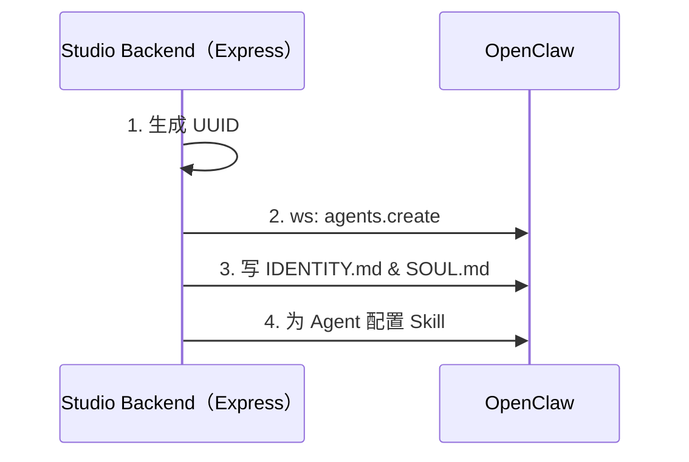

# 创建新的数字员工

## 业务流程

### 创建数字员工 Logic

1、生成 UUID
后端服务首先需要生成一个数字员工的 UUID。UUID 有两种来源： 
1. 通过参数传入 UUID；
2. 如果参数没有指定 UUID，则随机生成一个。

2、创建 Agent
通过 OpenClaw 的 WebSocket RPC 执行 `agents.create` method。参考：@docs/references/openclaw-websocket-rpc.md。

3、更新 IDENTITY.md 和 SOUL.md
通过 OpenClaw 的 WebSocket RPC 执行 `agents.files.list` method 更新 IDENTITY.md 和 SOUL.md。参考：@docs/references/openclaw-websocket-rpc.md。

4、为 Agent 配置 Skill
通过 OpenClaw 的 WebSocket RPC 执行 `skills.update` method， 通过 enable 参数为 Agent 配置白名单。参考：@docs/references/openclaw-websocket-rpc.md。

### 通过接口创建数字员工
提供 HTTP 接口来创建数字员工。
- endpoint: POST  /dip-studio/v1/digital-human